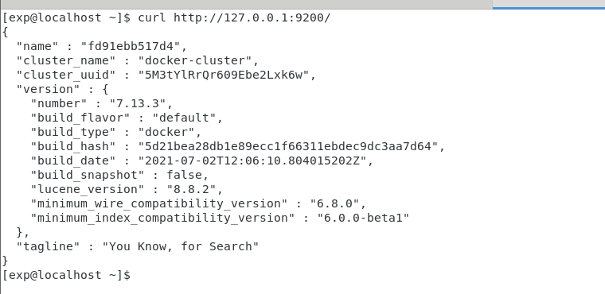
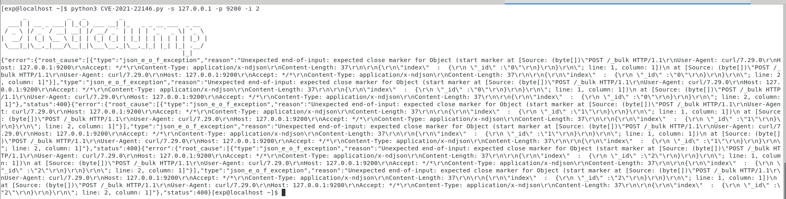

# CVE-2021-22146 Elasticsearch ECE 7.13.3 信息泄露漏洞

## 漏洞概述
所有版本的 Elastic Cloud Enterprise 在部署的集群中都默认启用 Elasticsearch“匿名”用户。虽然在默认设置下匿名用户没有权限并且无法成功查询任何 Elasticsearch API，但攻击者可以利用匿名用户来深入了解已部署集群的某些细节。

## 漏洞影响
Elastic ECE >= 7.10.0
Elastic ECE <= 7.13.3

## 环境搭建
漏洞环境
> https://github.com/errorecho/CVEs-Collection/tree/main/CVE-2021-22146/Env

运行漏洞环境
```
docker-compose up -d
```

访问`http://127.0.0.1:9200/`，环境运行成功



## 漏洞复现
### EXP
漏洞脚本
> https://github.com/errorecho/CVEs-Collection/tree/main/CVE-2021-22146/Exp/CVE-2021-22146.py

使用方法
```
python CVE-2021-22146.py -s ip -p port -i numbers
python CVE-2021-22146.py -s 127.0.0.1 -p 9200 -i 2
```



