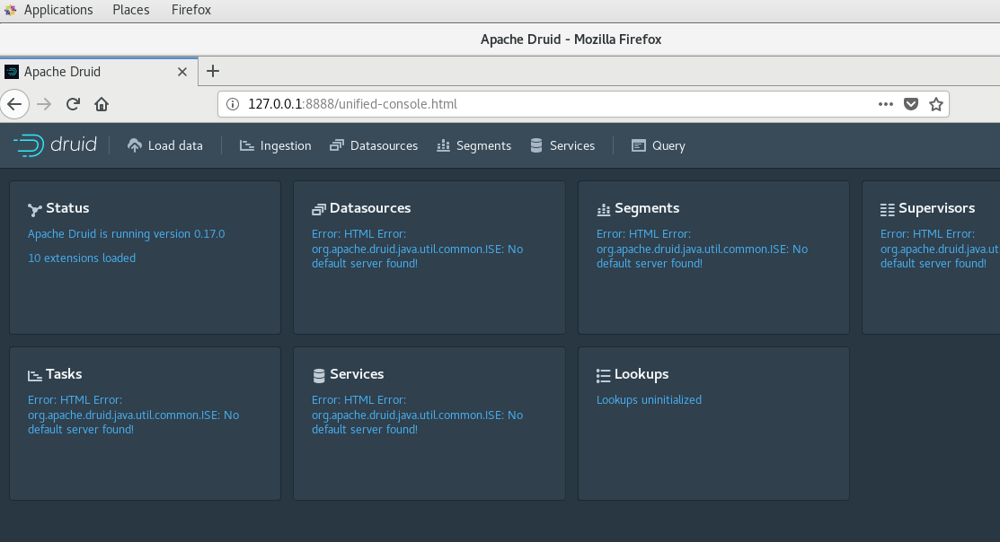
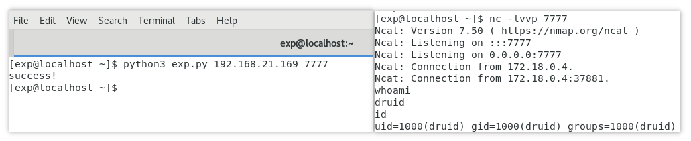

# CVE-2021-25646 Apache Druid 远程代码执行漏洞

## 漏洞概要
Apache Druid 是用Java编写的面向列的开源分布式数据存储，旨在快速获取大量事件数据，并在数据之上提供低延迟查询。
Apache Druid 默认情况下缺乏授权认证，攻击者可以发送特制请求，利用Druid服务器上进程的特权执行任意代码。

## 漏洞影响
Apache Druid < 0.20.1

## 环境搭建

漏洞环境
> https://github.com/errorecho/CVEs/tree/main/CVE-2021-25646/Env


运行漏洞环境
```
docker-compose up -d
```

访问`http://127.0.0.1:8888/`，环境成功运行



## 漏洞利用
利用工具
> 

使用方法
```
python3 CVE-2021-25646.py http://your-ip:8888 ip port
```


