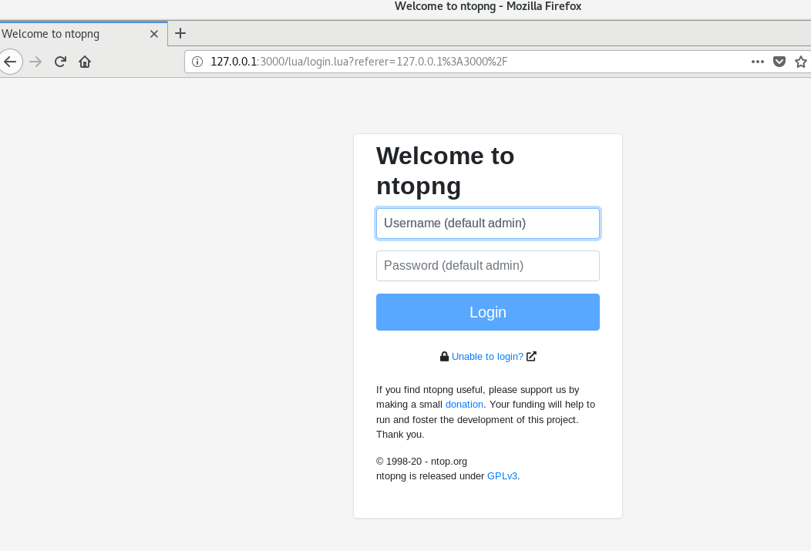
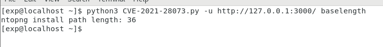
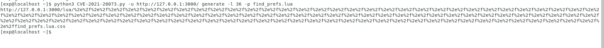
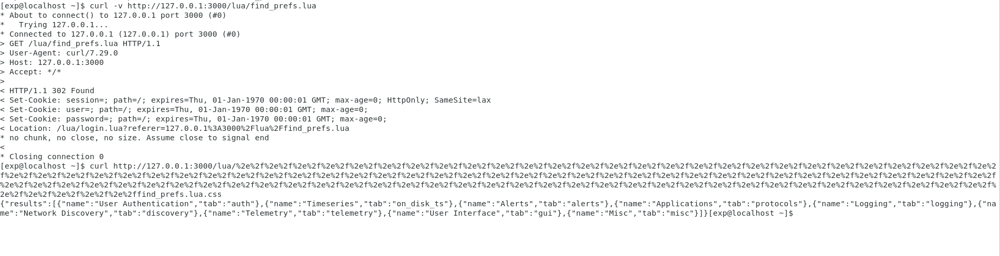

# CVE-2021-28073 Ntopng 权限绕过漏洞

## 漏洞概述
Ntopng对外提供web页面，其4.2及其以前版本web接口的权限认证绕过，导致攻击者可以在未授权的情况下请求符合漏洞利用条件的接口，并最终利用服务器端请求伪造和高危服务实现远程代码执行。

## 漏洞影响
ntopng commit < e8b9721479f401f595c5c7bb151819aceb03ad71

## 环境搭建
漏洞环境
> https://github.com/errorecho/CVEs-Collection/tree/main/CVE-2021-28073/Env

运行漏洞环境
```
docker-compose up -d
```

访问`http://127.0.0.1:3000/`，环境运行成功



## 漏洞复现
### EXP
漏洞脚本
> https://github.com/errorecho/CVEs-Collection/blob/main/CVE-2021-28073/Exp/CVE-2021-28073.py

使用方法
```
# 计算出ntopng lua目录的长度
python3 CVE-2021-28073.py -u http://127.0.0.1:3000/ baselength
```



找到我们想要越权访问的页面或接口，比如/lua/find_prefs.lua，正常访问时会302跳转到登录页面，无权限。  
```
# 使用脚本生成越权访问URL
python3 CVE-2021-28073.py -u http://127.0.0.1:3000/ generate -l 36 -p find_prefs.lua
```



访问此URL，可以越权返回正常信息



## 参考
> https://github.com/vulhub/vulhub/blob/master/ntopng/CVE-2021-28073/